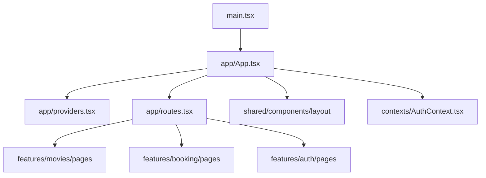

# Book-Watch Project Structure

## 📁 New Folder Organization

This project uses a clean, feature-based architecture optimized for backend integration.

### Directory Structure

```
src/
├── app/                          # Application shell
│   ├── App.tsx                   # Main app component (used by main.tsx)
│   ├── routes.tsx                # Central route definitions (AppRoutes)
│   └── providers.tsx             # Global providers (Router, React Query, Auth, Toasts)
│
├── features/                     # Feature-based modules
│   ├── auth/                     # Authentication feature
│   │   ├── components/
│   │   ├── hooks/
│   │   ├── services/             # authService.ts
│   │   ├── types/
│   │   └── pages/                # Auth.tsx
│   │
│   ├── movies/                   # Movies feature
│   │   ├── components/           # MovieCard.tsx
│   │   ├── hooks/
│   │   ├── services/             # movieService.ts
│   │   ├── types/
│   │   └── pages/                # Home.tsx, MovieDetail.tsx
│   │
│   ├── booking/                  # Booking feature
│   │   ├── components/
│   │   ├── hooks/
│   │   ├── services/             # bookingService.ts
│   │   ├── types/
│   │   └── pages/                # SeatSelection.tsx, TicketBook.tsx, Payment.tsx
│   │
│   └── events/                   # Events feature
│       ├── components/           # All event components
│       ├── hooks/
│       ├── services/
│       └── types/
│
├── shared/                       # Shared across features
│   ├── components/
│   │   ├── layout/               # Header.tsx, VerticalSidebar.tsx
│   │   ├── common/               # TimerCarousel.tsx
│   │   └── ui/                   # shadcn/ui components
│   │
│   ├── hooks/                    # Shared hooks
│   ├── services/
│   │   ├── api/
│   │   │   ├── client.ts         # API client
│   │   │   └── endpoints.ts      # API endpoints
│   │   └── storage/
│   │
│   ├── types/                    # Shared types
│   │   ├── common.ts             # Common types
│   │   └── api.ts                # API types
│   │
│   ├── utils/                    # Utility functions
│   │   ├── formatters.ts
│   │   ├── validators.ts
│   │   └── helpers.ts
│   │
│   └── constants/                # Constants
│       ├── routes.ts
│       ├── config.ts
│       └── messages.ts
│
├── contexts/                     # React contexts (global app state)
│   └── AuthContext.tsx           # Lightweight auth context using localStorage
│
├── lib/                          # External integrations & generated clients
│   └── supabase/                 # Supabase typed client (used by bookingService)
│       ├── client.ts             # createClient + auth/session config
│       └── types.ts              # Generated Database types
│
├── data/                         # Static data (temporary, used as fallback)
│   └── *.ts                      # Movies, events, activities, etc.
│
├── styles/                       # Global styles
│   ├── index.css
│   └── App.css
│
└── main.tsx                      # Vite entry point (mounts app/App.tsx)
```

## 🎯 Key Features

### 1. Feature-Based Organization

- Related code is grouped by feature (auth, movies, booking, events)
- Each feature has its own components, services, hooks, and types
- Easy to find and maintain related code

### 2. Service Layer

- Centralized API client (`shared/services/api/client.ts`)
- Feature-specific services (movieService, bookingService, authService)
- Ready for backend integration
- Currently uses static data/Supabase as fallback

### 3. Shared Resources

- Common components in `shared/components`
- Reusable utilities in `shared/utils`
- Centralized types in `shared/types`
- Constants in `shared/constants`

### 4. Clean Separation of Concerns

- Business logic in services
- UI in components
- State management in hooks/contexts
- Types in dedicated files

## 🔧 Import Paths

Use the `@/` alias for imports:

```typescript
// Shared components
import { Button } from "@/shared/components/ui/button";
import Header from "@/shared/components/layout/Header";

// Feature components
import MovieCard from "@/features/movies/components/MovieCard";

// Services
import { movieService } from "@/features/movies/services/movieService";

// Types
import type { Movie } from "@/shared/types/common";

// Constants
import { ROUTES } from "@/shared/constants/routes";
import { APP_CONFIG } from "@/shared/constants/config";

// Utils
import { formatCurrency } from "@/shared/utils/formatters";
```

Backend / services imports:

```typescript
// API client
import { apiClient } from "@/shared/services/api/client";
import { API_ENDPOINTS } from "@/shared/services/api/endpoints";

// Supabase client
import { supabase } from "@/lib/supabase/client";

// Feature services
import { movieService } from "@/features/movies/services/movieService";
import { bookingService } from "@/features/booking/services/bookingService";
import { authService } from "@/features/auth/services/authService";
```

## 🚀 Backend Integration

### Service Layer Structure

Each service is ready for backend integration, currently using static data/Supabase as fallback:

```typescript
// Example: movieService.ts
export const movieService = {
  async getMovies() {
    // Uncomment when backend is ready:
    // return await apiClient.get<Movie[]>(API_ENDPOINTS.MOVIES.LIST);

    // Temporary: Return static data
    return { data: staticMovies, success: true };
  },
};

// Example: bookingService.ts
export const bookingService = {
  async createBooking(bookingData: BookingData) {
    // Future:
    // return await apiClient.post(API_ENDPOINTS.BOOKINGS.CREATE, bookingData);

    // Current: store in Supabase
    const { data: { user } } = await supabase.auth.getUser();
    // ...insert into bookings table...
  },
};
```

### Migration Steps

1. **Keep static data as fallback** during development
2. **Implement backend API** endpoints
3. **Update service methods** to use API calls
4. **Test thoroughly** with real data
5. **Remove static data** files

## 📝 Development Guidelines

### Adding a New Feature

1. Create folder in `src/features/[feature-name]`
2. Add subfolders: `components`, `hooks`, `services`, `types`, `pages`
3. Create service file with API methods
4. Define types in `types/` folder
5. Build components using shared UI components
6. Add routes in `src/app/routes.tsx`

### Adding a New Component

- **Feature-specific**: Place in `features/[feature]/components/`
- **Shared/Reusable**: Place in `shared/components/common/`
- **Layout**: Place in `shared/components/layout/`

### Adding Utilities

- **Formatters**: Add to `shared/utils/formatters.ts`
- **Validators**: Add to `shared/utils/validators.ts`
- **Helpers**: Add to `shared/utils/helpers.ts`

### Adding Constants

- **Routes**: Add to `shared/constants/routes.ts`
- **Config**: Add to `shared/constants/config.ts`
- **Messages**: Add to `shared/constants/messages.ts`

## 🧪 Testing

```bash
# Run development server
npm run dev

# Build for production
npm run build

# Lint code
npm run lint
```

## 📦 Benefits

1. **Scalability**: Easy to add new features without cluttering existing code
2. **Maintainability**: Clear structure makes code easy to understand
3. **Reusability**: Shared components and utilities are easily accessible
4. **Type Safety**: Centralized types improve type checking
5. **Backend Ready**: Service layer makes API integration straightforward
6. **Team Collaboration**: Clear boundaries between features

## 🔄 Migration Status

- ✅ Folder structure created
- ✅ Constants extracted
- ✅ Types centralized
- ✅ Utilities created
- ✅ Service layer implemented
- ✅ Components organized by feature
- ✅ Pages moved to features
- ✅ Import paths updated to use `@/` alias
- ⏳ Testing in progress (end-to-end flows)

## 📚 Next Steps

1. Test application functionality end-to-end
2. Integrate with real backend API (replace static data usage)
3. Gradually remove static data files from `src/data`
4. Add comprehensive tests (unit + integration)

## 🗺️ High-Level App Flow (Mermaid)



Aa diagram ma tame joi shako cho ke application `main.tsx` thi start thai ne, `app/App.tsx`, global `Providers`, central `Routes`, ane pachi alag-alag **feature pages** sudhi flow kare chhe.
